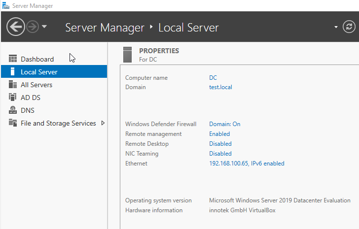
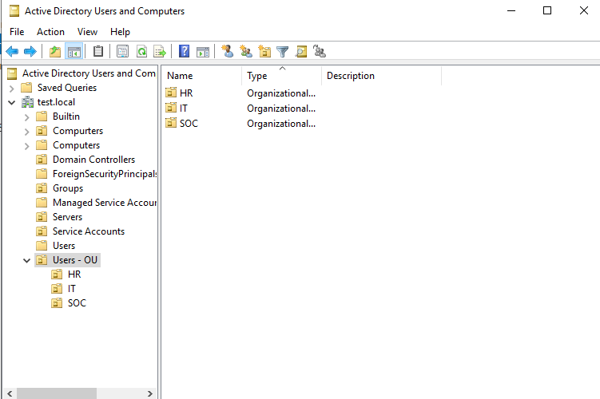
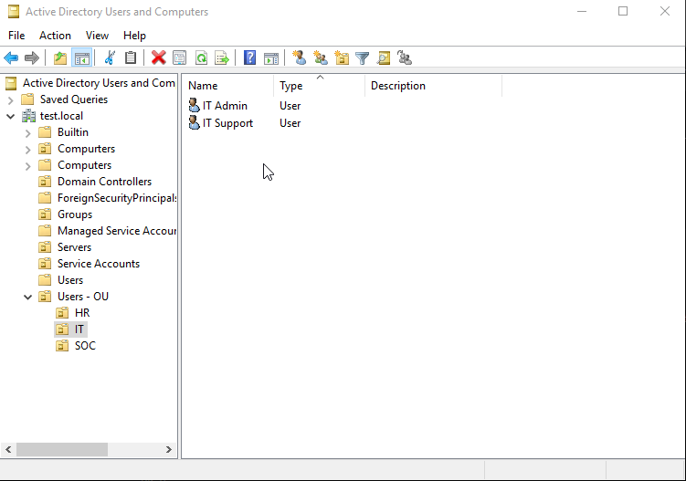
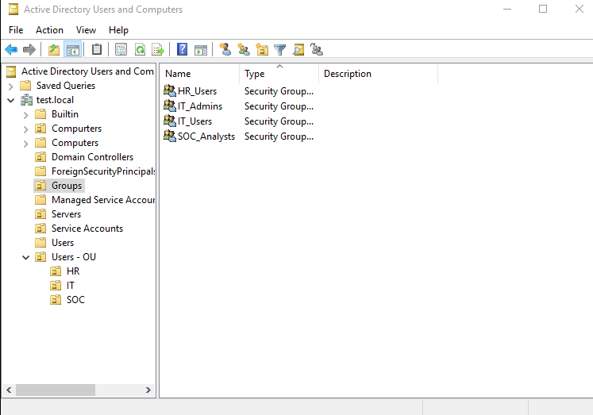
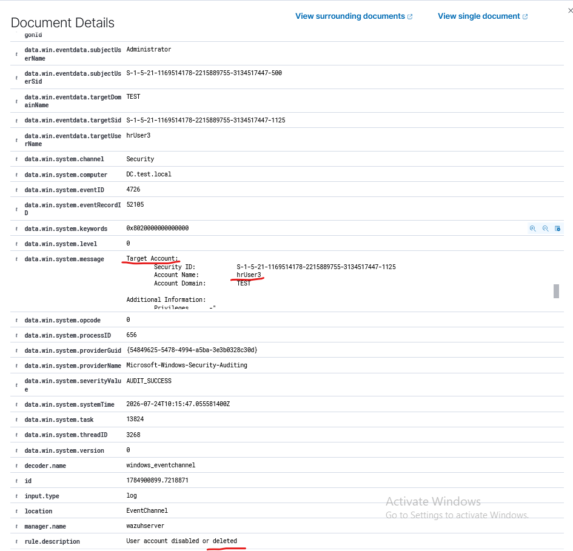
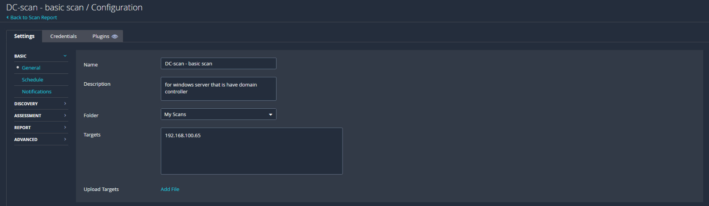
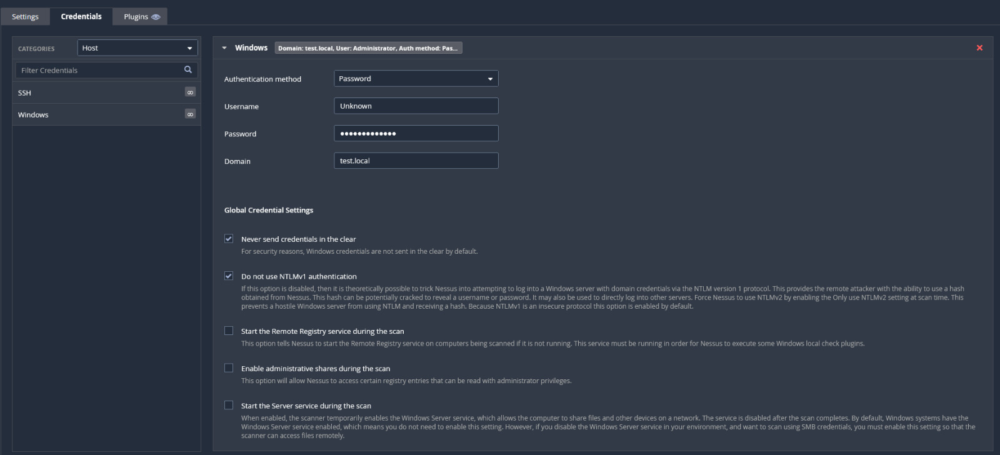
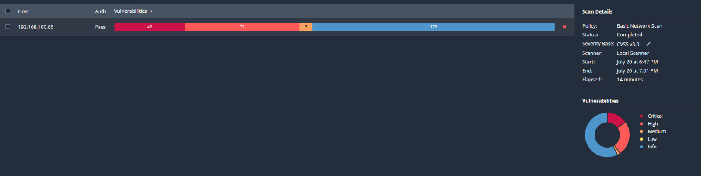
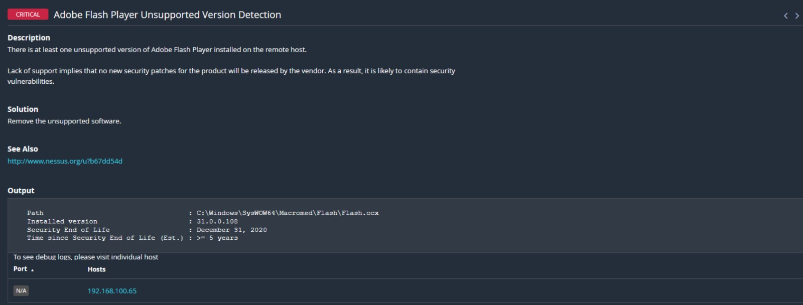
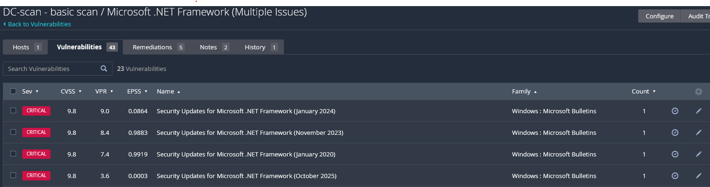

# Enterprise SOC Lab with Wazuh SIEM and Nessus

## Project Overview

> This project demonstrates the design and implementation of an enterprise Security Operations Center (SOC) lab using Wazuh SIEM, Active Directory, Windows event auditing, PowerShell monitoring, and Nessus vulnerability assessment to simulate real-world security monitoring and incident detection.

---

# Lab Architecture

                          Physical PC #1 (Windows 11 Host)
                          ===============================

     +---------------------------+       Running VirtualBox       +------------------------------+
     |    Windows 11 Host        | -----------------------------> |    Windows Server 2019       |
     | • Tenable Nessus          |                                | Active Directory / DNS / DC  |
     | • Wazuh Agent             |                                | • Wazuh Agent                |
     +---------------------------+                                +------------------------------+
               |                                                         |
               | Security Events                                         | Security Events
               | (via Wazuh Agent)                                       | (via Wazuh Agent)
               |                                                         |
               +-----------------------------+---------------------------+
                                             |
                                             v
                     Physical PC #2 (Ubuntu Server)
                     =========================================

                         +------------------------------------+
                         | Ubuntu Server                      |
                         |     (Wazuh SIEM Server)            |
                         | Wazuh Manager                      |
                         | Wazuh Indexer                      |
                         | Wazuh Dashboard                    |
                         +------------------------------------+
---

# Lab Components

| Component | Purpose |
|-----------|---------|
| Ubuntu Server | Wazuh SIEM Server |
| Windows Server 2019 | Active Directory Domain Controller |
| Windows 11 | Administrative Workstation |
| Wazuh | Security Information and Event Management (SIEM) |
| Nessus | Vulnerability Assessment |

---
# Active Directory

A Windows Server 2019 virtual machine was configured as the Domain Controller for the lab environment by deploying **Active Directory Domain Services (AD DS)**. The domain provides centralized identity management, authentication, and administrative control for the Windows clients monitored by Wazuh.

The Active Directory environment was used throughout the project to generate authentication events, account management activities, and privilege-related changes that were later detected and analyzed by the SIEM platform.

---

## Domain Configuration

The Windows Server was promoted to a Domain Controller and configured with the **TEST.local** domain. This server acts as the central authentication authority for all domain users and computers within the lab.

| Component | Configuration |
|-----------|---------------|
| Operating System | Windows Server 2019 |
| Computer Name | DC |
| Domain | TEST.local |
| Server Role | Active Directory Domain Services (AD DS) |

---

## Organizational Unit (OU) Structure

To simulate a real enterprise environment, Organizational Units (OUs) were created to logically separate users by department. A parent OU (**Users - OU**) was created, containing dedicated OUs for Human Resources, Information Technology, and Security Operations.

The following organizational structure was implemented:

- Users - OU
  - HR
  - IT
  - SOC

---

## User and Group Management

User accounts and security groups were created to simulate role-based administration within the Active Directory environment.

Example user accounts created during the lab include:

- IT Admin
- IT Support

Example security groups include:

- HR_Users
- IT_Admins
- IT_Users
- SOC_Analysts

These accounts and groups were later used to generate security events, including account creation, account deletion, privilege changes, password resets, account lockouts, and group membership modifications that were monitored by Wazuh.

### User Accounts

### Security Groups

---
# Detection Scenarios

- Successful Logon
- Failed Logon
- Account Lockout
- User Account Creation
- User Account Deletion
- Password Reset
- User Enable / Disable
- Domain Admin Group Membership Changes
- PowerShell Monitoring

## 1. Successful Logon

### Objective

Verify that Wazuh detects successful authentication attempts on the Domain Controller.

**Windows Event ID:** 4624

**Wazuh Rule ID:** 60106

**Wazuh Alert Level:** 3 (Low severity)

### Detection Process

A successful domain logon was performed using valid credentials.
The event was generated on Windows Server 2019, collected by the Wazuh Agent, and forwarded to the Wazuh Manager where it triggered Rule 60106.

### Evidence

> **Wazuh Dashboard**

---

## 2. Failed Logon

A failed logon attempt was generated using an incorrect password.

**Windows Event ID:** 4625

**Wazuh Rule ID:** 60122

**Wazuh Alert Level:** 5 (Low severity)

The detection workflow is identical to the Successful Logon scenario, except that Wazuh classified the event as a failed authentication attempt.

---

## 3. Account Lockout

### Objective

Verify that Wazuh detects user account lockout events after multiple failed authentication attempts.

**Windows Event ID:** 4740

**Wazuh Rule ID:** 60115

**Wazuh Alert Level:** 9 (Medium Severity)

### Detection

To simulate an account lockout, multiple failed logon attempts were performed using an incorrect password until the configured Account Lockout Policy was triggered.

Windows generated **Event ID 4740**, which was collected by the Wazuh Agent and forwarded to the Wazuh Manager. Wazuh successfully identified the event and generated **Rule ID 60115**, allowing security analysts to quickly detect potential brute-force attacks or repeated unauthorized authentication attempts.

### Evidence

> **Wazuh Dashboard**

## 4. User Account Creation

### Objective

Verify that Wazuh detects the creation of new user accounts in Active Directory.

**Windows Event ID:** 4720

**Wazuh Rule ID:** 60109

**Wazuh Alert Level:** 8 (Medium Severity)

### Detection

A new Active Directory user account was created on Windows Server 2019 using the Active Directory Users and Computers (ADUC) console.

Windows generated **Event ID 4720**, which was collected by the Wazuh Agent and forwarded to the Wazuh Manager. Wazuh successfully identified the event and generated **Rule ID 60109**, allowing security analysts to monitor newly created accounts and detect unauthorized account provisioning.

### Evidence

> **Active Directory Users and Computers**

> **Wazuh Dashboard**

---

## 5. User Account Deletion

### Objective

Verify that Wazuh detects the deletion of Active Directory user accounts.

**Windows Event ID:** 4726

**Wazuh Rule ID:** 60111

**Wazuh Alert Level:** 8 (Medium Severity)

### Detection

An existing Active Directory user account was deleted from Windows Server 2019.

Windows generated **Event ID 4726**, which was collected by the Wazuh Agent and forwarded to the Wazuh Manager. Wazuh successfully detected the deletion event and generated **Rule ID 60111**, providing visibility into account removal activities.

The detection workflow is identical to the **User Account Creation** scenario, with the only difference being the account deletion action.

### Evidence

> **Wazuh Dashboard**

---

## 6. Password Reset

### Objective

Verify that Wazuh detects password reset activities in Active Directory.

**Windows Event ID:** 4724

**Wazuh Rule:** 60110

**Wazuh Alert Level:** 8 (Medium Severity)

### Detection

A password reset operation was performed for an Active Directory user account.

Windows generated **Event ID 4724**, which was collected by the Wazuh Agent and forwarded to the Wazuh Manager.Wazuh successfully detected the deletion event and generated **Rule ID 60110**, providing visibility into account removal activities.

### Evidence

> **Wazuh Dashboard**

---
## 7. User Account Enabled

### Objective

Verify that Wazuh detects when a disabled Active Directory user account is re-enabled.

**Windows Event ID:** 4722

**Wazuh Rule:** 60109

**Wazuh Alert Level:** 8 (Medium Severity)

### Detection

A previously disabled Active Directory user account was enabled using the Active Directory Users and Computers (ADUC) console.

Windows generated **Event ID 4722**, which was collected by the Wazuh Agent and forwarded to the Wazuh Manager. Although this event does not have a dedicated Wazuh detection rule, it was successfully collected through the generic Windows EventChannel rules while preserving the original Windows Event ID.

### Evidence

> **Wazuh Dashboard**

---
## 8. User Account Disabled

### Objective

Verify that Wazuh detects when an Active Directory user account is disabled.

**Windows Event ID:** 4725

**Wazuh Rule:** 60111

**Wazuh Alert Level:** 8 (Medium Severity)

### Detection

An Active Directory user account was disabled on Windows Server 2019.

Windows generated **Event ID 4725**, which was collected by the Wazuh Agent and forwarded to the Wazuh Manager through the generic Windows EventChannel rules while preserving the original Windows Event ID.

The detection workflow is identical to the **User Account Enabled** scenario, with the only difference being the account status change.

### Evidence

> **Wazuh Dashboard**

---

## 9. Domain Admin Group Membership

### Objective

Verify that Wazuh detects modifications to the **Domain Admins** security group.

**Windows Event ID:** 4728

**Wazuh Rule ID:** 60159

**Wazuh Alert Level:** 12 (High severity)

### Detection

A standard Active Directory user was added to the **Domain Admins** security group using the Active Directory Users and Computers (ADUC) console.

Windows generated **Event ID 4728**, which was collected by the Wazuh Agent and forwarded to the Wazuh Manager. Wazuh successfully identified the activity and generated **Rule ID 60159 (Domain Admins Group Changed)**.

This type of event is considered highly critical because unauthorized changes to privileged groups may indicate privilege escalation or unauthorized administrative access within the Active Directory environment.

### Evidence

> **Active Directory Users and Computers**

> **Wazuh Dashboard**

---

# Vulnerability Assessment

To evaluate the security posture of the Active Directory environment, a credentialed vulnerability assessment was performed using **Tenable Nessus** against the Windows Server 2019 Domain Controller.

## Scan Configuration

The vulnerability assessment was configured as a **credentialed scan** using Windows authentication to provide comprehensive visibility into the target system.

| Setting | Value |
|---------|-------|
| Scanner | Tenable Nessus |
| Scan Type | Credentialed Scan |
| Target | Windows Server 2019 Domain Controller |
| Authentication | Windows Credentials |
| Purpose | Identify missing security updates, insecure configurations, and known vulnerabilities |

## Scan Results

The credentialed Nessus scan identified multiple security findings across the Windows Server 2019 Domain Controller. The assessment revealed several missing security updates and known vulnerabilities that could impact the confidentiality, integrity, and availability of the system if left unpatched.

### Vulnerability Summary

| Severity      | Count |
| ------------- | ----: |
| Critical      |    46 |
| High          |    77 |
| Medium        |    7  |
| Low           |    77 |
| Info          |    173|

## Key Findings

The vulnerability assessment identified several high-risk findings. The most significant vulnerabilities are summarized below.

| Vulnerability | Severity | Description |
|--------------|----------|-------------|
| SIGRed (CVE-2020-1350) | Critical | Remote code execution vulnerability affecting Microsoft DNS Server. |
| Microsoft .NET Framework | High | Missing security updates affecting the .NET Framework. |
| Adobe Acrobat / Reader | High | Missing security patches for Adobe products. |

 > **SIGRed (CVE-2020-1350)**

.jpeg)

 > **Adobe Acrobat / Reader**

 > **Microsoft .NET Framework**

---

# Remediation

> Security updates and vulnerability mitigation.

Based on the assessment results, the following remediation actions are recommended:

- Apply the latest Microsoft cumulative security updates.
- Patch the Microsoft .NET Framework to the latest supported version.
- Remove unsupported software such as Adobe Flash Player.
- Regularly perform credentialed vulnerability assessments.
- Verify remediation by rescanning the affected systems.

---

# Lessons Learned

The credentialed vulnerability assessment successfully identified multiple critical and high-risk vulnerabilities affecting the Active Directory Domain Controller. These findings demonstrate the effectiveness of credentialed scanning in identifying operating system weaknesses, missing security updates, and unsupported software that may not be visible through unauthenticated network scans.

---
